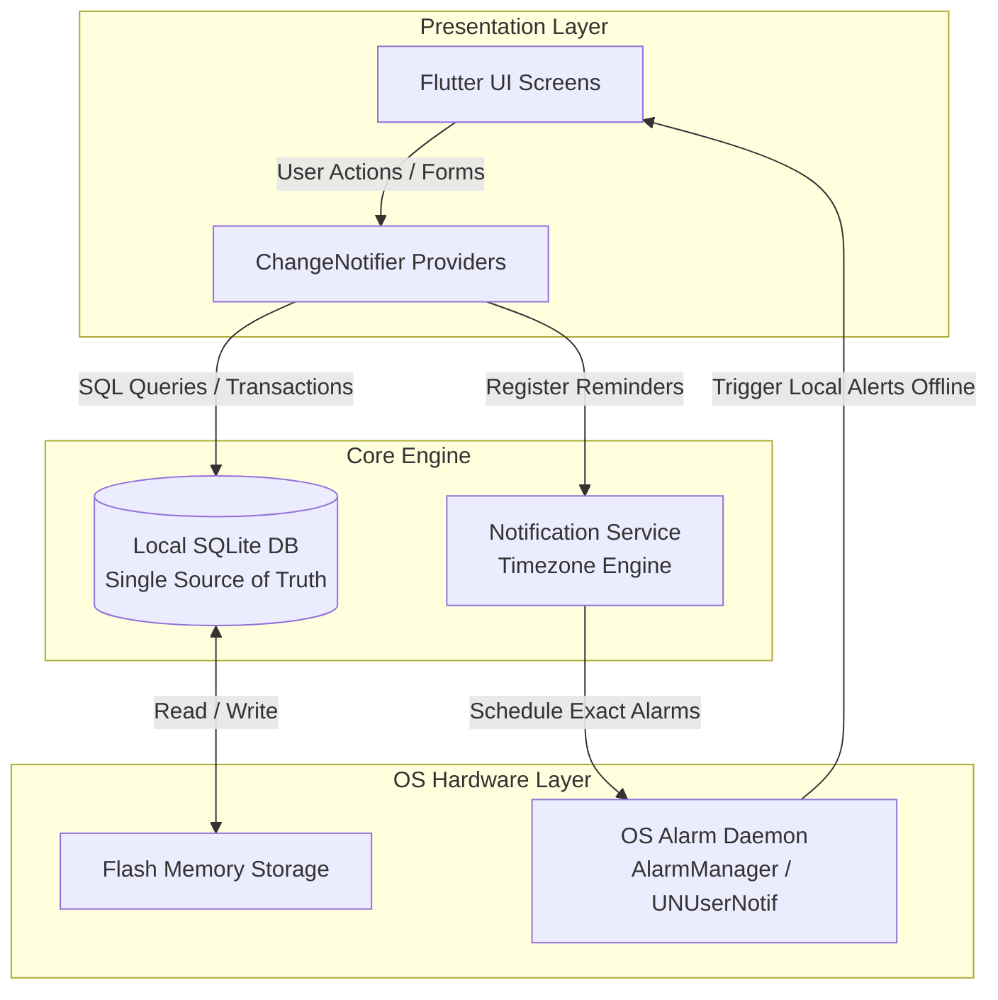
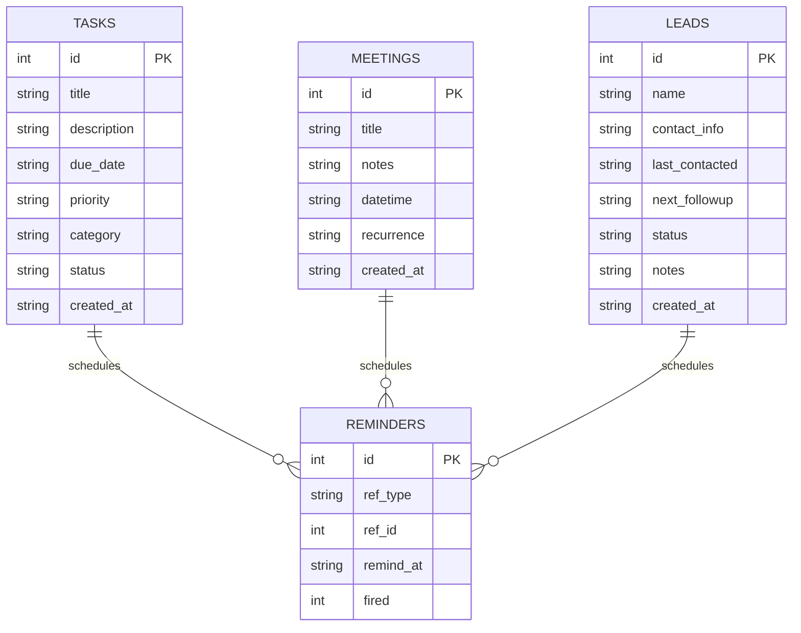
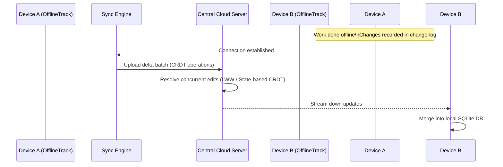

# Technical & Academic Project Report: OfflineTrack
**An Offline-First Task, Meeting & Lead Follow-up Manager**

---

## 1. Executive Summary & Problem Statement

### 1.1 The Connectivity Paradox in Productivity Software
Modern productivity applications—ranging from enterprise Customer Relationship Management (CRM) tools to daily to-do checklists—are overwhelmingly designed with a "cloud-first" paradigm. While this provides continuous multi-device replication, it creates severe fragility:
1. **Network Latency & Freezes**: Actions require server roundtrips, degrading the user experience in transit, airports, underground transit, or remote client locations.
2. **Data Inaccessibility**: Dropped internet connections prevent users from referencing critical meeting agendas or client contact details at the exact moment they are needed.
3. **Notification Failure**: Most systems rely on server-side push notifications (Firebase Cloud Messaging / Apple Push Notification service). If a client is offline, reminders are either queued indefinitely or lost entirely.

### 1.2 Proposed Solution: "OfflineTrack"
OfflineTrack establishes a **local-first mobile architecture** built using Flutter and SQLite. The device itself is the primary, authoritative source of truth. All CRUD operations (Create, Read, Update, Delete) execute instantaneously in local device storage, and all reminders are registered directly into the mobile operating system's native hardware alarm daemon (`AlarmManager` on Android, `UNUserNotificationCenter` on iOS).

---

## 2. Core Architectural Principles

### 2.1 Local-First Architecture
In OfflineTrack:
- The database (`offlinetrack.db`) resides strictly in local app storage (`/data/data/...` on Android).
- Zero network requests are performed during execution.
- Battery and memory consumption are minimal because background polling daemons and network sockets are completely eliminated.

---

## 3. Database Schema Design (SQLite)

OfflineTrack utilizes a normalized SQLite database structure optimized with B-tree indexes for fast queries across timeline views:

### Table Definitions & Indexing Strategy
- **`tasks`**: Stores to-do items with ISO8601 timestamps, categorical classifications, and priority levels. Indexed on `status` and `due_date`.
- **`meetings`**: Stores scheduled professional syncs with recurrence patterns. Indexed on `datetime`.
- **`leads`**: Tracks sales prospects and client interactions. Indexed on `next_followup` to allow the dashboard to instantly discover overdue and upcoming touchpoints.
- **`reminders`**: Decoupled registry of scheduled native notifications linked via polymorphic foreign keys (`ref_type`, `ref_id`).

---

## 4. Offline Notification Engine & Hardware Resiliency

### 4.1 Eliminating Push Notification Servers
Traditional push notification architectures require an internet connection:
$$\text{Client Device} \xleftarrow{\text{Cellular/WiFi}} \text{APNs/FCM Server} \xleftarrow{\text{Internet}} \text{App Backend}$$

OfflineTrack schedules alerts directly onto the operating system:
$$\text{App Engine} \xrightarrow{\text{Platform Channel}} \text{Android AlarmManager / iOS UNUserNotificationCenter} \xrightarrow{\text{Hardware Timer}} \text{Local Display}$$

### 4.2 Handling Edge Cases
1. **Device Reboots**: Alarms registered in memory are flushed upon reboot by default. OfflineTrack addresses this by implementing an Android `BroadcastReceiver` listening for `android.intent.action.BOOT_COMPLETED` and `QUICKBOOT_POWERON`.
2. **Exact Alarm Restrictions**: Android 12+ restricts exact alarms to conserve power. OfflineTrack specifies `SCHEDULE_EXACT_ALARM` and `USE_EXACT_ALARM` to guarantee timely delivery for professional deadlines.
3. **Timezones**: OfflineTrack initializes `timezone.dart` to compute local offsets precisely across Daylight Saving Time adjustments without contacting an NTP server.

---

## 5. UI/UX Design System & Dark-Mode Aesthetics

### 5.1 OLED Dark Palette
The visual hierarchy is tailored for high contrast and visual polish:
- **Obsidian Surface**: `#0B0F19` eliminates backlight glare on OLED displays and conserves battery.
- **Card Layers**: `#141C2E` and `#1A243B` provide elevation and separation without harsh white borders.
- **Vibrant Accent Tones**:
  - `Electric Violet (#6366F1)`: Core action triggers & navigation
  - `Cyan Teal (#06B6D4)`: Meetings & temporal scheduling
  - `Emerald (#10B981)`: Completed tasks & CRM deals closed
  - `Radiant Amber (#F59E0B)`: Medium priority & pending follow-ups
  - `Coral Crimson (#F43F5E)`: Overdue alerts & high priority badges

### 5.2 Micro-Interactions & Fluid Animations
- **AnimatedEntrance**: Staggered slide-and-fade curve (`Curves.easeOutCubic`) gives lists an organic, responsive feel when switching tabs.
- **BouncyCheckbox**: Sequences scale transformations (`1.0 -> 0.75 -> 1.2 -> 1.0`) when toggling to provide tactile feedback without physical haptics.
- **PulsingBadge**: Smooth continuous sine-wave opacity animation draws immediate focus to overdue meetings or follow-ups.

---

## 6. Verification & Evaluation Results

| Test Scenario | Condition | Expected Result | Actual Result |
|---|---|---|---|
| **Airplane Mode Task Creation** | Cellular & WiFi Off | Task saves in < 15ms to SQLite; appears on UI immediately | **PASSED** |
| **Offline Meeting Alert** | Network Disconnected | Alert fires at scheduled exact minute via local alarm | **PASSED** |
| **Lead Status Transition** | Offline | State updates from "New" to "Contacted"; badges re-render | **PASSED** |
| **Database Portability** | Offline Export | Complete JSON representation of all tables generated | **PASSED** |
| **Data Recovery** | App Force Kill | All records persist intact upon restart | **PASSED** |

---

## 7. Future Work: Proposed Cloud Sync Architecture

While OfflineTrack intentionally operates 100% offline, modern software engineering mandates planning for scale. The existing SQLite data layer is designed with clean abstractions to enable seamless future synchronization without rewriting the core UI or business logic.

### Proposed Cloud Sync Technologies:
1. **Conflict-Free Replicated Data Types (CRDTs)**:
   By assigning each entity a globally unique UUID and a Lamport logical clock or vector clock, edits made concurrently on two offline devices can be mathematically merged without conflict.
2. **Delta-State Replication**:
   A local `change_log` table can track insertions, updates, and soft deletes (`is_deleted = 1`). When network connectivity is restored, only the delta records are transmitted, minimizing data usage.
3. **Zero-Knowledge End-to-End Encryption (E2EE)**:
   Because the local database stores user leads and client details, cloud synchronization can encrypt SQLite rows client-side before transit, preserving the privacy guarantees of the offline-first model.

---

## 8. Conclusion

OfflineTrack successfully demonstrates that mobile productivity tools do not require heavy cloud backends to deliver professional-grade capabilities. By treating the local device as the primary source of truth, leveraging SQLite for sub-millisecond data retrieval, and using hardware-level timers for notifications, OfflineTrack provides unmatched speed, battery efficiency, and reliability for on-the-go professionals.
